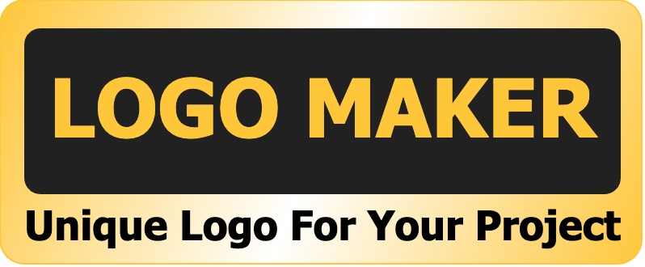

# <div align="center"></div>

### <div align="center"><b>English | <a href="README_CN.md">简体中文</a></b></div>

<div align="center">

[](https://github.com/reamd/logo-maker/releases)
[](https://github.com/reamd/logo-maker/issues)
[](https://github.com/reamd/logo-maker/issues)
[](https://github.com/reamd/logo-maker/blob/master/LICENSE)

</div>

> :rocket: You can use this open source project as a starting point for creating a unique logo for your project..

## :computer:How to use

### Online use
[https://logo-maker.djfos.fun](https://logo-maker.djfos.fun)

### Locally

1. Clone this repository

```bash
git clone https://github.com/reamd/logo-maker.git
cd logo-maker
```

2. Install dependencies

```bash
npm install
```

3. Start web-application

```bash
npm run dev

http://localhost:5173/
```

## :star:Contact

If you have any question, please follow me on X:

[](https://x.com/DJ_wilderness)
